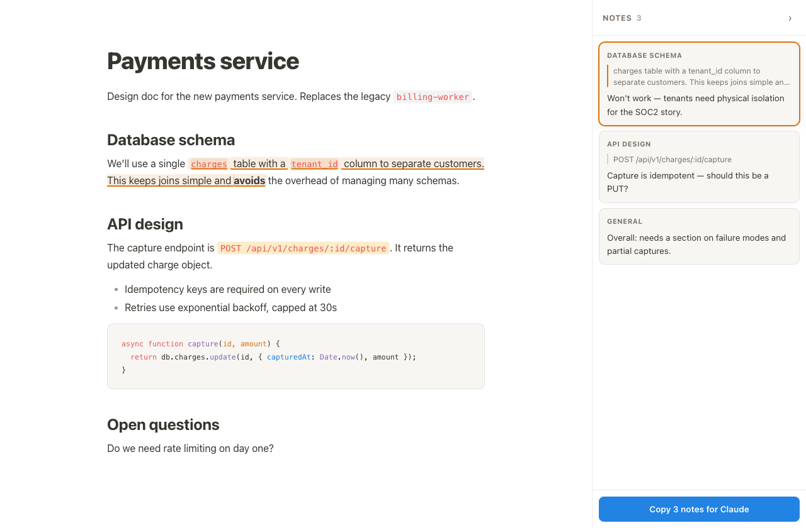

# mdopen

## What this is

A CLI (`md foo.md`) that renders a Markdown file to a **single self-contained
HTML file** in a temp dir and opens it in the browser. The page carries an
annotation layer: select text, leave notes, then copy the whole set back out as
markdown to paste into a coding agent. `.html` files work too: opened **as-is**
with only the annotation layer injected.

## Why it exists

The loop it serves: **an agent writes a doc → you read it in the browser → you
need to tell the agent what's wrong.** Before the annotation layer, that meant
manually retyping "in the database section, the bit about tenant_id — that won't
work" back into a terminal. Tedious enough that feedback got dropped.

So the copy output *is the product*. It's the only part an agent ever sees. The
UI can be ugly and the tool still works; if the output format is wrong, nothing
else matters. Weigh changes accordingly.

The output is **quote-anchored, never line-numbered**, because quoted snippets
survive the agent rewriting the doc and line numbers don't:

```
Feedback on docs/architecture.md (2 notes)

1. § Database schema
   > "a single charges table with a tenant_id column"
   Won't work — tenants need physical isolation for the SOC2 story.

2. General
   Too much detail on schema, not enough on failure modes.
```



Dark mode is a first-class target, not an afterthought — most reading happens
there (`docs/annotated-dark.png`).

## Project intent

A **small open-source project**, deliberately. The interesting idea isn't
"markdown annotator" — a dozen of those exist. It's *the copy-paste loop between
you and your coding agent*. Keep the scope near that.

Bias toward **light**: no build step, no framework, no server, no dependencies
beyond the four markdown/highlighting libs already in `package.json`. The whole
thing is three `.mjs` files that concatenate strings. A change that adds
infrastructure needs to earn it.

## Layout

| File | Role |
| --- | --- |
| `render.mjs` | CLI entry. Markdown → HTML, injects CSS + JS, opens browser. |
| `styles.mjs` | Exports `CSS` — document styling, light + dark via `prefers-color-scheme`. |
| `annotate.mjs` | Exports `ANNOTATE_CSS` + `ANNOTATE_JS` — the client annotation layer. |

`annotate.mjs` writes its client code as a **real function**, then stringifies it
on export (`"(" + client.toString() + ")();"`). This keeps it readable and free
of template-literal escaping. Consequence: the client code must never contain a
literal `</script>`, and it can't close over anything in module scope.

`~/.local/bin/md` points **straight at this checkout** — edits are live, no
install step. Moving or deleting this repo breaks `md` everywhere. `MDOPEN_DIR`
overrides the location. `package.json` also declares `bin` entries (`md`,
`mdopen`) so the package is installable via npm; keep `render.mjs` executable
(it has a shebang) or the symlink install path breaks.

## Design decisions worth knowing

**Notes persist, keyed by a hash of the markdown source — not the file path.**
`render.mjs` stamps `data-md-hash` onto `<body>`; the client stores notes in
`localStorage` under that key. Restore therefore only ever runs against a
byte-identical document, which is what makes it simple: no fuzzy re-anchoring, no
orphaned-note UI. Edit the doc and the notes are stale by definition, so they
correctly don't come back. Re-running `md` on an unchanged file restores them
even though the temp path changed.

This was originally built with **no persistence at all**, on the reasoning that
you annotate in one sitting and paste immediately. That was wrong: leaving a doc
open for a few hours is normal, the browser discards the background tab, and
every note is silently gone. `beforeunload` doesn't catch tab discard. Persistence
is not optional — don't "simplify" it away.

**The copy header carries a usable path, and local images are inlined.**
`data-md-file` is the path relative to the `md` invocation's cwd (absolute if
the file lives outside it) so the agent knows which file the feedback targets.
Local images become `data:` URIs at render time because the HTML lives in a
temp dir where relative paths would dangle; remote URLs pass through.

**html mode is string surgery, not parsing.** A `<base>` tag (so the temp
copy's relative assets resolve against the original directory — the client
compensates for the side effect on `#links`), a dataset bootstrap, and the
style/script block spliced in before `</body>`. No HTML parser, so nothing
else about the page can change.

**The annotation UI owns its palette.** `ANNOTATE_CSS` uses only `--anno-*`
variables, defined in its own `:root` block with values mirroring styles.mjs
(update both when theming). This is what lets the layer drop into arbitrary
host HTML without inheriting the host's colors/fonts or clobbering its CSS
variables. The article is `.markdown-body` or, in html mode, `<body>` itself.

**Anchors are character offsets into the article's text content.** Wrapping text
in `<mark>` splits text nodes but never changes the characters, so an offset
stays valid no matter how many highlights already exist. That's why offsets are
storable and node paths are not.

**Agents must stay read-only against the doc.** If anything ever edits the `.md`
while the page is open, it changes the hash (killing persistence) and shifts every
anchor (breaking every highlight) while the user is mid-comment. Any future
agent integration replies in threads and proposes diffs; applying them is an
explicit, terminal act that ends the review pass and re-renders.

## Landmines

These are real bugs that were hit and fixed. They bite silently.

**Never read a quote from a Range after wrapping or `normalize()`.** Unwrapping
calls `parent.normalize()`, which merges the exact text nodes a Range's
boundaries point at, corrupting it. Reading the quote afterward silently
truncates it — the UI looks perfect while the copy output is wrong. Capture
quote, geometry, and anchor *before* any DOM surgery; `save()` promotes the
existing pending marks in place rather than re-wrapping.

**Anything clickable that opens the composer must `stopPropagation()`.** The
document click handler treats a click outside the composer as "close it". Without
stopping propagation, the click that opens the composer immediately closes it.

**When the article is `<body>` (html mode), the panel's text is inside it.**
The sidebar shows each note's quote, so a restore that walks all text nodes
finds the quote text twice and can re-anchor marks onto the panel itself.
`textIndex()` must skip UI nodes (`inUI`) — and anything else that reads
document text needs the same care.

**Inline `<code>` needs `:has()` for continuous highlights.** A `<mark>` around
the text can't reach the code element's own padding, so highlights spanning
inline code look broken into segments. Fixed with
`:not(pre) > code:has(mark.anno)`.

## Testing

There are no unit tests. Verify by driving a real browser — the selection/Range
handling is where bugs live, and it cannot be checked by reading the code.

Playwright **blocks `file://`**, so serve the render over http:

```sh
node render.mjs demo.md --no-open --out demo.html
python3 -m http.server 8731     # then drive http://localhost:8731/demo.html
```

Always exercise a selection **spanning element boundaries** (a range that starts
inside `<code>` and ends inside `<strong>`) — single-text-node selections pass
while the real cases fail. Then check the actual clipboard output, not just that
the UI looks right.

To screenshot dark mode, rewrite the media query rather than hand-copying tokens,
so the shot uses the real shipped CSS:

```sh
sed 's/(prefers-color-scheme: dark)/(min-width: 0px)/g' demo.html > demo-dark.html
```

## Deliberately not built

- **A server / live-reload.** Considered and rejected: it fights the annotation
  model (see "Agents must stay read-only").
- **Inline agent replies in each thread.** Wanted, not built. There is no
  supported way to attach to a running `claude` CLI session, but
  `claude -p --resume <id> --fork-session` does give a separate process a copy of
  that session's context (verified). Cost is the blocker: ~$0.25 per reply against
  a 148K transcript, and real sessions run far larger. Most useful context is on
  disk (the doc, the repo, CLAUDE.md) rather than in the session anyway.
- **Re-anchoring notes onto a rewritten doc.** The hard problem the content-hash
  design exists to avoid. Don't wander into it without a strong reason.
