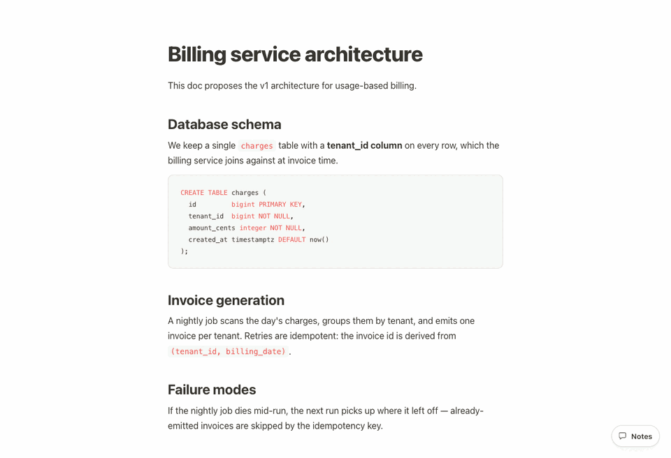
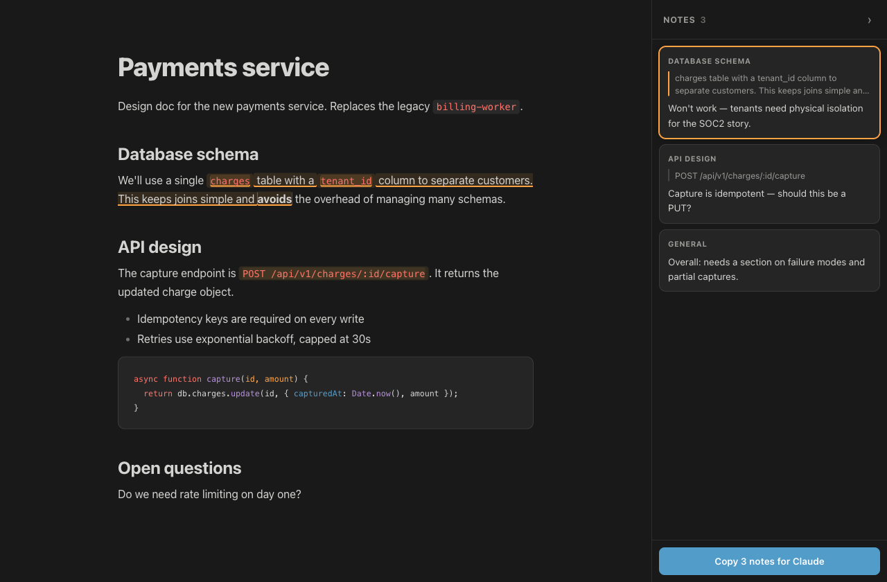

# mdopen

Render a Markdown file to a **self-contained, styled HTML page**, open it in
the browser, and **annotate it** — then **copy the annotations back out as
markdown** you can paste straight into a coding agent.

Built for the loop where **an agent writes a doc, you read it, and you need to
tell it what's wrong** — without tedious back-and-forth in a terminal.

```sh
md architecture.md
```



## Why this one

- **One self-contained HTML file.** No server, no build step, no browser
  extension. CSS, JS, and images are all inlined into the page.
- **Works in any browser** — including the ones embedded in terminals like
  cmux, or an IDE preview pane. It's just an HTML file; if something can
  render HTML, it works.
- **Output built for agents.** Notes are quote-anchored, never line-numbered,
  so the agent can still find every one after it rewrites the doc.
- **Agent-agnostic.** The feedback is plain markdown on your clipboard — paste
  it into Claude Code, Codex, or whatever you drive your codebase with.

## Annotating

- **Select any text** → a *Comment* pill appears, or press <kbd>⌘K</kbd>.
- <kbd>⌘K</kbd> with nothing selected leaves a general note on the whole doc.
- <kbd>⌘↵</kbd> saves, <kbd>Esc</kbd> cancels.
- Notes collect in a side panel, sorted into document order. Hover a card to
  edit (✎) or delete (×) it.
- **Copy for Claude** puts the whole set on your clipboard:

```
Feedback on docs/architecture.md (2 notes)

1. § Database schema
   > "a single users table with a tenant_id column"
   Won't work — tenants need physical isolation for the SOC2 story.

2. General
   Too much detail on schema, not enough on failure modes.
```

Each note carries its section heading and the quoted passage, so the agent can
find every one even after it rewrites the doc. The header names the file by its
path relative to where you ran `md`, so the agent knows exactly which file to
act on.

## Persistence

Notes are saved to `localStorage`, keyed by a hash of the **markdown source**
rather than the file path. So:

- Reload, tab discard, or browser restart → notes come back.
- Re-running `md` on an unchanged file → notes come back (the temp path is
  irrelevant).
- The doc gets edited → notes do **not** come back, because they're stale.

Keying on content is what keeps this simple: restore only ever runs against a
byte-identical document, so there's no fuzzy re-anchoring and no orphaned-note
UI. Anchors are character offsets into the document text, which stay valid
regardless of how many highlights are already applied.

Entries older than 30 days are pruned automatically.

## Dark mode

Follows `prefers-color-scheme`.



## Images

Local images referenced by the markdown are inlined into the HTML as `data:`
URIs, so the page stays self-contained even though it lives in a temp dir.
Remote (`http(s)`) images are left as-is. Missing files get a warning on
stderr and keep their original path.

## Flags

```
md <file.md> [--no-open] [--no-annotate] [--out <path>]
```

- `--no-open` — print the generated path instead of opening a browser
- `--no-annotate` — plain rendered HTML, no annotation layer
- `--out <path>` — write to a specific path instead of a temp dir

## Layout

| File | What it is |
| --- | --- |
| `render.mjs` | CLI entry: markdown → HTML, injects CSS + JS, opens the browser |
| `styles.mjs` | `CSS` — Notion-inspired document styling, light + dark |
| `annotate.mjs` | `ANNOTATE_CSS` + `ANNOTATE_JS` — the client-side annotation layer |

`annotate.mjs` writes its client code as a real function and stringifies it on
export, which keeps it readable and free of template-literal escaping.

## Install

```sh
npm install -g mdopen   # installs the `md` (and `mdopen`) command
```

Or run straight from a checkout — edits are live, no install step:

```sh
npm install   # or: bun install
ln -s "$PWD/render.mjs" ~/.local/bin/md
```

## A note on trust

The rendered page executes any raw HTML the markdown contains — that's how
markdown works. Fine for docs you or your agent wrote; think twice before
running `md` on markdown from someone you don't trust.

## License

MIT
